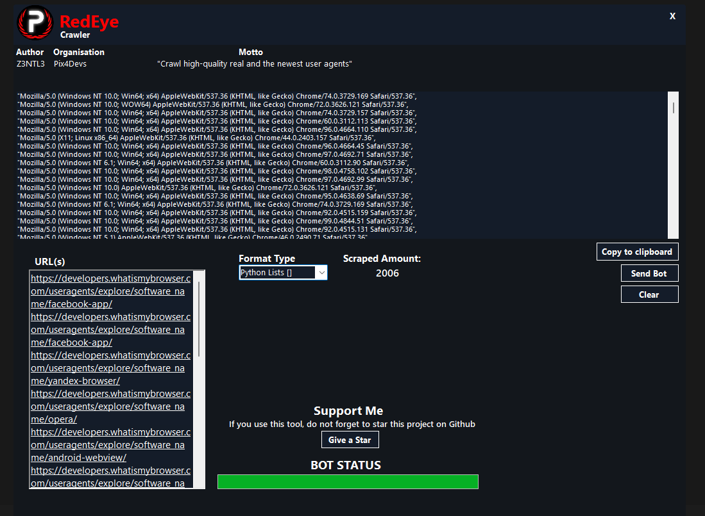

# RedEye


Crawl real and new user agents from the most major 2 databases. 
<a href="https://www.youtube.com/watch?v=kfjVTS1uiVE"> Usage and Proof</a>Br>
<a href="https://www.virustotal.com/gui/file-analysis/MTk2MTMyYTQ5MGIxMWViNDE2NGRkYTU1NWZhMmE1NDU6MTY1MTQ4NDA5NQ=="> Virus Total Scan</a>
<table><tr><th>Organisation</th><th>Application</th><th>Developer</th></tr><tr><td>PIX4</td><td>RedEye</td><td>Z3NTL3</td></tr></table>


### Features
- 2 Big User Agents Databases (```developers.whatismybrowser.com```,```useragents.io```)
- Fast Crawl
- Python List, Javascript Array and Normal formats

### Developer
**This application is developed by Z3NTL3 for Pix4.**

By using the application you agree to the following terms of use:
- Stealing code and using it for your own use case is not allowed
- Modifying the application is not allowed
- Selling the application for money is not allowed

**As Pix4 developers, we strive to develop open-source free applications. Please respect our work and so follow the terms of use.**

